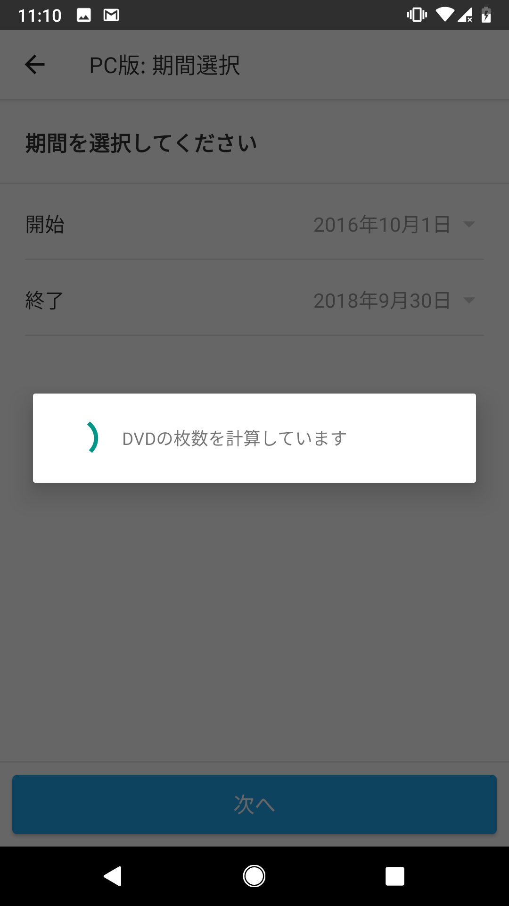
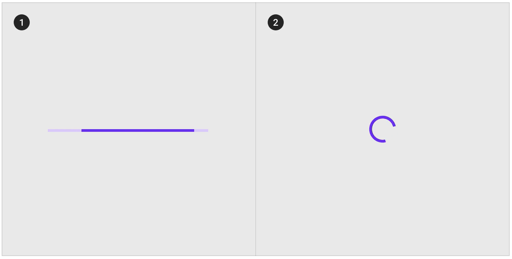

# [fit]今時のProgress indicator

### by punchdrunker

---

# 自己紹介

- 高校卒業まで札幌在住
- 2010年〜 iOS/Androidのアプリを書いてみる
- 2011年〜 ミクシィ
- 家族アルバム みてね
- DroidKaigiとかshibuya.apk運営

---

# 課題



- 11月までにはtargetSdk26にしないと
- ProgressDialogはAPI26から非推奨に
- とりあえず置換したDialogFragmentはIllegalStateException
- そもそもMaterial Designに準拠するべき

---

# 用語の説明

- ProgressDialog
  - かつて利用されていたクルクルDialogクラス
- ProgressBar
  - 今最も利用されていそうなクルクルを表示するクラス
- Progress indicators
  - Material Design Guidelineに出てくる名称で、単に「進捗を表示する部品」

---

# 背景

[公式のリファレンス](https://developer.android.com/reference/android/app/ProgressDialog)では、API Level26からProgressDialogは公式に非推奨とされ、 **ProgressBar** や **通知** を使って進捗を表示するべき、という記載

---

# ProgressDialogの功罪

- Toastライクに気軽に表示できる
  - コピペされがち
- 表示中に画面の操作を禁止できる
  - ユーザにとっては不自由に感じる
- DialogFragmentで類似品も実装できる
  - ライフサイクルに気を付けないと...

---

# MDC的クルクル (Progress indecators)

## 用途

待ち時間/処理時間の表現をするためのもの

## 種類

Linear と Circular の2つ

[material.ioより](https://material.io/design/components/progress-indicators.html)

---

Linear と Circular の2つは同じProgressBarで、styleを指定する事で形を変える事が出来る

どっちを使ってもいいけど、どちらかに統一した方が良い



---

# 進捗表示のための原則

- Informative: ただの装飾ではなく意味のある表示
- Animated: 注意を引く必要がある
- Consistent: 一貫性

---

# 配置

処理や通信が完了した時に表示される部分に埋め込まれているべき。

リストが表示される予定の場所に埋め込んだり、選択したitemに沿って表示するなど。

---


---


---

表示を待つ表現は書いてあるけど、更新系は?
(ユーザーの投稿や編集操作など)

---

# 有名なアプリの事例

- twitter
- facebook
- gmail
- airbnb

---

# 有名なアプリの事例

投稿、編集、削除はそもそも処理中表示せずに、完了したフリをしてエラーになったら通知することが多い

通信するからといって、全ての通信処理でProgressBarを表示する必要はない

---

# ProgressBarを出す条件

どうしてもユーザーを待たせないといけないところで使うようにした方がユーザーには優しい

新しい情報の取得は通信などの処理が終わらないと表示できないが、それ以外の操作は基本的にごまかせる。

---

# 置き換えが面倒なパターン

- ボタンをタップ
- 何らかの通信処理
- 成功したら次の画面に引数を渡しながら遷移

データを表示すべき場所にindicatorを配置しないといけなくなったので、
画面遷移してから通信を行い、ProgressDialogを

---

# [fit]おまけ: 時間のかかる処理の表現

---


---

こんなUI標準で用意されてない...

---
# 作ろう

Buttonを継承して、Viewを自前でゴニョゴニョすれば出来そう。

面倒なので今回はConstrainLayoutを継承して、ClickableなCustomViewを作った。
Layoutの実装であればxmlでレイアウトを定義できて簡単に見た目をいじることが出来る。

---

# レイアウト(大体)

TextViewとProgressBarのvisibilityを切り替えればよさそう。
今回だけでなく、データを表示する予定の場所にindicatorを置く場合はvisibilityの切り替えが簡単そう。

``` xml
<androidx.constraintlayout.widget.ConstraintLayout ...>

    <TextView android:text="Tap!" ... />
    <ProgressBar android:visibility="gone" ... />

</androidx.constraintlayout.widget.ConstraintLayout>
```

---
# 実装

コンストラクタで inflateして、OnClickListenerとタッチイベントを自前でハンドリング

---
# 実装

``` kotlin
class CustomButton(context: Context, attrs: AttributeSet?) : ConstraintLayout(context, attrs) {
    var cListener: OnClickListener? = null
    constructor() { ... // inflate}
    override fun setOnClickListener(listener: OnClickListener?) {
        cListener = listener
    }
    override fun dispatchTouchEvent(ev: MotionEvent): Boolean {
        ... // ACTION_UPでonClickをinvoke
    }

    // Activityから呼ぶ
    fun toggle() { ... // visibility更新 }
}
```

---
# Activity側

``` kotlin
binding.customButton.setOnClickListener {
    button -> (button as CustomButton).toggle()
}
```
---

# FIN
