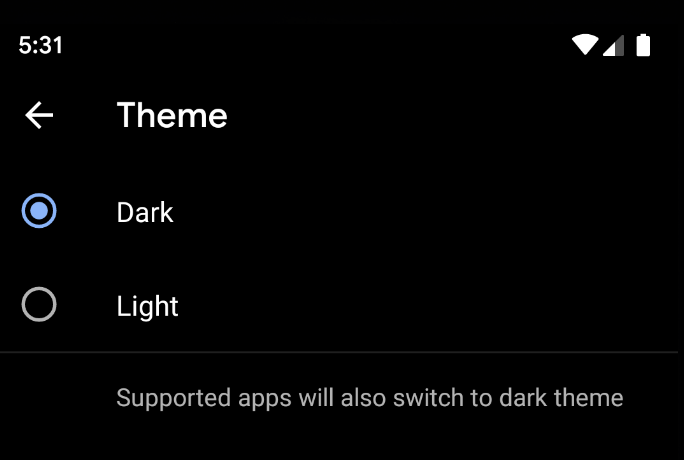

# [fit] getting started with dark theme

by punchdrunker

---

# 自己紹介

- 2010年〜 iOS/Androidのアプリを書いてみる
- 2011年〜 SNS mixi(ミクシィ)
- 2016年〜 家族アルバム みてね(ミクシィ)
- DroidKaigiとかshibuya.apkを運営

---

# Dark theme

Qから新しい Dark themeになった(Pからあった)

- 省電力
- 視覚障害のある人にやさしい
- 暗い所で見やすくなる

---

# 開発者が取るべき対応

---

# 開発者が取るべき対応

何もしなくても特に困らない

^OSの設定により、 `-night` というサフィックスがついたリソースが有効になるだけ

---

# 対応した方がいいアプリ

- 暗いところでも使って欲しいなら対応してあげると親切
- 背景が真っ白なアプリとかは省エネ効果ありそう
- すでにUiModeManager(API 8から)でnight mode対応しているアプリは対応が必要
  - AppCompatDelegateの同等機能に移行
    - -night リソースを利用するのは一緒なので、対応は楽

---

# ユーザーとしての使い方

- 設定アプリから有効に
- 通知メニューの編集から追加することもできる
- Pixelだとバッテリーセーバーを有効にした時もDark themeになる

^ 変更することでnight リソースが優先して表示されるようになります

---

# 開発者側から見た使い方

- AppThemeをDayNightを継承したものにすると(必須)
  - Theme.MaterialComponents.DayNightを推奨
  - (Theme.AppCompat.DayNight もある)
- DayNightなAppThemeを設定することで、Viewの背景など良い感じにしてくれる

---

# 開発者側から見た使い方

基本的には-night なリソースが優先して参照される

- drawable-night
- values-night などなど

---

# 開発者側から見た使い方

- UiModeManager(api 8以上)
  - Pまでなら、これだけで似たような事が実現できる。
- AppCompatDelegate(api 14以上)
  - 端末のモード切り替えを参照できる
  - Qのnight nodeに対応

正直何が違うかよくわからない。。。

---

// 変更して
AppCompatDelegate.setDefaultNightMode(mode)
// 反映する
// appcompat:1.1.0-alpha05からは不要
delegate.applyDayNight()

// 変更の通知はこれが呼ばれる
onNightModeChanged(mode)

---

# mode

- MODE_NIGHT_FOLLOW_SYSTEM
- MODE_NIGHT_NO
- MODE_NIGHT_YES
- MODE_NIGHT_AUTO
  - 時間判定ぽい?

---

# 色の決め方

MDGにあるとおり

primary color で言うと
- 黒を使うとしても、真っ黒は避ける(#121212くらい)
- もともとの色を使いたい場合は、そのままではなくの彩度を下げると良い(4.5:1に下げたもの)

---

# 色の定義を整理するには

アプリの構造によって対応方針が変わるので、正解はなさそう。現状から最も良い方針を考えましょう。

以下のような印象

- 色名にblackとかwhiteとか使うのはやめた方がよさそう(transparentならいいかも)
- 機能や部品の名前にしましょう

---

# Demo 

https://github.com/punchdrunker/hocho/pull/46/files

---
# Reference

基本仕様
https://developer.android.com/preview/features/darktheme

Androidでのデフォルト実装について
https://material.io/develop/android/theming/dark/

関連API
https://developer.android.com/reference/androidx/appcompat/app/AppCompatDelegate.html#MODE_NIGHT_FOLLOW_SYSTEM

---
# Reference

具体的な対応方針はMDGから
https://material.io/design/color/dark-theme.html#usage

実践的な紹介
https://medium.com/androiddevelopers/appcompat-v23-2-daynight-d10f90c83e94
